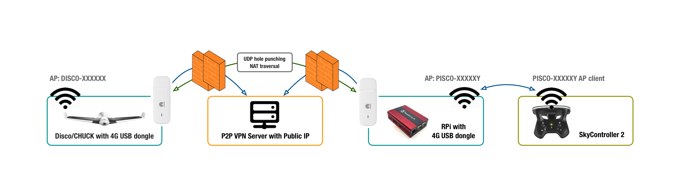

# About disco4g

Disco4g is a LTE/4G software mod for Parrot Disco drone. It adds capability to connect SkyController 2 (SC2) and Free Flight Pro app (FFP) with Disco over 4G datalink - and possibly operate drone beyond its wifi coverage. Both control/telemetry and live video should be working - given that enough 4G data bandwidth is available in the exact flying area.

What needs to be modded:
* Disco firmware
* SkyController 2 firmware (optional)

## Status

NB! This is still an experimental hack, no thorough testing has been conducted! Mod and fly Disco entirely at your own risk!!!

What seems to work so far:
* Drone discovery and connection initialization - which for some reason takes about 3x longer than over wifi (10s vs 30s)
* Receiving video stream in FFP app (high latency due 4G nature)
* Recovering datalink when 4G disconnects/reconnects happen
* Switching from Wifi to 4G profile and vice versa (manually from FFP app)

TODOs:
* Clean up scripts and add comments
* Introduce main config files and reconfiguration at boot
* Write installers
* Improve documentation
* Test and optimize

## Parrot Disco over LTE/4G Demo (Youtube)

## Requirements

* Parrot Disco drone (firmware v1.4.1)
* Parrot SkyController 2 (firmware v1.0.7)
* Raspberry Pi 2/3 (OS Rasbian Stretch Lite)
* USB Wifi dongle for Raspberry Pi with AP and IE (Information Elements) capabilities
* 2x Huawei 3372 LTE/4G USB dongles
* 2x 4G SIMs with data plans
* Cloud VM or one of the SIMs with public IP attached

## Theory of Operation

TODO

## Installation instructions

* [Disco/CHUCK](Disco/README.md)
* [SkyController 2](SC2/README.md)
* [Raspberry Pi](RPi/README.md)
* [VPN Server](VPN/README.md)

## Usage instructions

TODO
