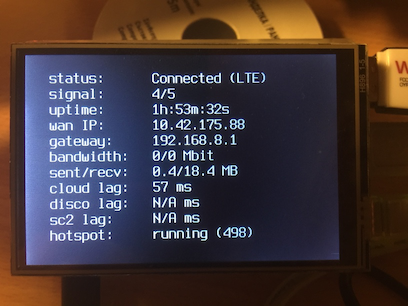

# About Raspberry Pi for LTE/4G mod

Currently RPi is required in order to pretend as another Disco drone to SC2 and to setup a network tunnel between RPi and real Disco over 4G (or over any other alternative network link that you can provide and that has sufficient bandwidth). Work for loosing RPi as a "middle-man" and connecting SC2 directly and reliably to Disco over 4G tethering is underway - but as you might guess its more complicated to achieve.

## Development environment

* Connect RPi ethernet interface to LAN router (which provides or forwards LAN DHCP service)
* Lookup RPi ethernet DHCP lease
* Connect to RPi via ssh

## Installation

### Raspbian installation

* https://www.raspberrypi.org/documentation/installation/installing-images/ 
* https://downloads.raspberrypi.org/raspbian_lite_latest
* https://hackernoon.com/raspberry-pi-headless-install-462ccabd75d0

```bash
# download latest raspbian OS image
curl -O https://downloads.raspberrypi.org/raspbian_lite_latest
unzip 2018-04-18-raspbian-stretch-lite.zip

# download and install etcher.io image installer
https://etcher.io

# fire up etcher.io app and flash downloaded Raspbian image to microSD card

# Add "ssh" File to the SD card boot filesystem (this is MacOSX specific example here)
sudo touch /Volumes/boot/ssh

# boot raspbian
# lookup RPi DHCP IP from LAN router (or monitor network with tcpdump)
# login with pi:raspberry
ssh pi@<rpi_ipaddr>

# NB! Change default password!
passwd

# change to root user
sudo su -

# set root user passwd as well
passwd

# enable root user ssh login
vi /etc/ssh/sshd_config
--- MODIFY ---
PermitRootLogin yes
--- MODIFY ---

# update OS
apt-get update
apt-get upgrade

# install screen, vim
apt-get install screen vim

# disable rootfs filechecks on boot
vim /etc/fstab
--- MODIFY ---
PARTUUID=e4ffb18f-02  /               ext4    defaults,noatime  0       0
--- MODIFY ---

# reboot for sshd config changes and possible kernel updates
reboot
```

### General configuration

```bash
# install some useful utils
apt-get install tcpdump telnet nano vim android-tools-adb dnsutils screen ncftp
```

### Setup PISCO Access Point (AP)

PISCO AP will simulate another drone for SkyController 2 to discover - which would be the exact same DISCO drone but accessed over 4G datalink.
SC2 will scan for wifi networks which set Information Element (IE) based on drone serial in wlan info. We are using hostapd software in order to create such AP. In order it to work your WIFI device must support AP mode and setting IE fields. 

More info about suitable WIFI chipsets and drivers can be found here: https://w1.fi/cgit/hostap/plain/hostapd/README 
RPi3 and hostapd howto: https://frillip.com/using-your-raspberry-pi-3-as-a-wifi-access-point-with-hostapd/

```bash
# first we need to lookup Disco IE field contents

# power ON your Disco
# AND plug-in your RPi USB Wifi dongle (if not using any built-ins)

# whats is your USB Wifi dongle interface?
ifconfig -a 
# set interface variable for later use
IFACE="wlan0"

# lookup Disco serial from wifi IE field
DISCO_ID="$( iwlist wlan0 scan | awk '/DISCO/' | cut -d'-' -f2 | tr -d '"' )"
echo $DISCO_ID

# lookup Disco IE field
DISCO_ID_PADDED="$( echo $DISCO_ID | fold -w1 | paste -sd'3' - )"
echo $DISCO_ID_PADDED 
DISCO_IE="$( iwlist wlan0 scan | awk '/'."$DISCO_ID_PADDED".'/ { print $3 }' )"
echo $DISCO_IE

# NB! Change DISCO name to PISCO
# AND increment by +1 last digit of DISCO_ID and 3rd digit from backwards of DISCO_IE value 
# (increment the Y char in examples)
# final results should be having following format/changes
PISCO_ID="PISCO-XXXXXY"
PISCO_IE="DDXXXXXXXXXXXXXXXXXXXXXXXXXXXXXXXXXXXXXXXXXXXXXXXY00"

# producing PISCO_ID
DISCO_BASE=${DISCO_ID:0:5}
DISCO_INCR=${DISCO_ID: -1}
let DISCO_INCR+=1
PISCO_INCR=${DISCO_INCR: -1}
PISCO_ID="PISCO-${DISCO_BASE}${PISCO_INCR}"
echo $PISCO_ID

# producing PISCO_IE
DISCO_IE_BASE=${DISCO_IE:0:-3}
PISCO_IE="${DISCO_IE_BASE}${PISCO_INCR}00"
echo $PISCO_IE

# install software for creating PISCO Access Point
apt-get install hostapd dnsmasq wpasupplicant

# create hostapd.conf
# shell variables required: 
# IFACE
# PISCO_ID
# PISCO_IE

cat << EOF > /etc/hostapd/hostapd.conf
#AP for PISCO
interface=$IFACE
ssid=$PISCO_ID
ieee80211n=1
# wifi not enrypted atm
#wpa=2
#wpa_passphrase=your_passphrase
#wpa_key_mgmt=WPA-PSK
#rsn_pairwise=CCMP
vendor_elements=$PISCO_IE
hw_mode=g
ignore_broadcast_ssid=0
channel=6
logger_syslog=-1
logger_syslog_level=1
EOF

# set hostapd.conf system variable for correctness
# but we actually are not going to use hostapd init script
# as we start hostapd when hotplugging wlan0 interface
sed -i -- 's/^#DAEMON_CONF=""/DAEMON_CONF="\/etc\/hostapd\/hostapd.conf"/g' /etc/default/hostapd 
systemctl stop hostapd
systemctl disable hostapd

# deny dhcpc wlan interface management
# as otherwise it causes problems with starting hostapd
# shell variables required:
# IFACE

echo "denyinterfaces $IFACE" >> /etc/dhcpcd.conf
systemctl restart dhcpcd 

# lookup your SC2 macaddr
# method 1: telnet 192.168.42.1 (while connected to Disco AP) and run ulogcat while powering on SC2
# you should see Controller IP & Mac address lines appearing in log output
# method 2: plug USB ethernet device to SC2 and cable with LAN router
# use adb to connect and ifconfig to list SC2 wlan interface mac addr

# set SC2 WIFI mac address
SC2_MACADDR="a0:14:3d:ce:c2:4f"

# set static IPADDR to be assigned to SC2
SC2_IPADDR="192.168.42.50"

# create wifi interface configuration file
# shell variables required:
# IFACE

cat << EOF > /etc/network/interfaces.d/${IFACE}
allow-hotplug $IFACE
auto $IFACE
iface $IFACE inet static
address 192.168.42.200
netmask 255.255.255.0
post-up /usr/local/bin/$IFACE-routes
hostapd /etc/hostapd/hostapd.conf
EOF

# create wifi interface route file (for enabling backroute to SC2_IPADDR)
# shell variables required:
# IFACE
# SC2_IPADDR

cat << EOF > /usr/local/bin/$IFACE-routes
#!/bin/sh
echo 1 > /proc/sys/net/ipv4/conf/$IFACE/proxy_arp
ip route add $SC2_IPADDR dev $IFACE
EOF

# make route script executable
chmod +x /usr/local/bin/$IFACE-routes

# create dnsmasq dhcp server configuration for PISCO AP
# shell variables required:
# IFACE
# SC2_MACADDR
# SC2_IPADDR

cat << EOF > /etc/dnsmasq.d/pisco-ap.conf
interface=lo,$IFACE
no-dhcp-interface=lo
dhcp-range=192.168.42.201,192.168.42.219,255.255.255.0,12h
dhcp-option=3
# SC2 macaddr:static_ip mapping
dhcp-host=$SC2_MACADDR,$SC2_IPADDR
EOF

# (re)start dnsmasq service
systemctl restart dnsmasq

# bring wlanX (and hostapd) up
ifup $IFACE
```

### Setup drone discovery over zeroconf 

In order for SC2 to be able to discover simulated PISCO drone we need to setup avahi-daemon with ardiscovery.service drone profile.
More info about Avahi can be found here: https://www.avahi.org/

```bash
# install avahi-daemon for PISCO discovery
apt-get install avahi-daemon

# set hostname to PISCO_ID
# shell variables required: 
# PISCO_ID

hostnamectl set-hostname $PISCO_ID
echo "192.168.42.1 $PISCO_ID.local" >> /etc/avahi/hosts

# lookup device_id PIXXXXXXXXXXXXXXXY from FFP app (or from Disco /etc/avahi/avahi_daemon.conf) and increment Y by +1
# and use PISCO_ID as name field value

cat << 'EOF' > /etc/avahi/services/ardiscovery.service
<?xml version="1.0" standalone='no'?><!--*-nxml-*-->
<!DOCTYPE service-group SYSTEM "avahi-service.dtd">
<service-group>
<name replace-wildcards="yes">PISCO-XXXXXY</name>
<service>
<type>_arsdk-090e._udp</type>
<port>44444</port>
<txt-record>{"device_id":"PIXXXXXXXXXXXXXXXY"}</txt-record>
</service>
</service-group>
EOF

# reconfigure avahi-daemon
cp -p /etc/avahi/avahi-daemon.conf /etc/avahi/avahi-daemon.conf.bak
cat << 'EOF' > /etc/avahi/avahi-daemon.conf
[server]
use-ipv4=yes
use-ipv6=yes
ratelimit-interval-usec=1000000
ratelimit-burst=1000
[wide-area]
enable-wide-area=no
[publish]
publish-aaaa-on-ipv4=no
publish-a-on-ipv6=yes
[reflector]
[rlimits]
rlimit-core=0
rlimit-data=4194304
rlimit-fsize=0
rlimit-nofile=768
rlimit-stack=4194304
rlimit-nproc=3
EOF

# (re)start avahi-daemon
systemctl restart avahi-daemon
```

### Setup Tinc P2P VPN

```bash
# install tinc p2p vpn
apt-get install tinc

# set local node vpn tunnel address
NODE_VPN_IPADDR="192.168.42.13"

# set cloud and disco vpn peers IP addresses
PEER_VPN_NODES="192.168.42.11 192.168.42.12"

mkdir -p /etc/tinc/vpn0/hosts/

# create tinc configuration
cat << EOF > /etc/tinc/vpn0/tinc.conf
Name = rpi
AddressFamily = ipv4
Interface = tun0
ConnectTo = cloud
PriorityInheritance = yes
ProcessPriority = high
EOF

# create vpn up script
# shell variables required: 
# NODE_VPN_IPADDR

cat << EOF > /etc/tinc/vpn0/tinc-up
ifconfig \$INTERFACE $NODE_VPN_IPADDR netmask 255.255.255.0
ip route add 192.168.42.0/24 dev \$INTERFACE proto kernel scope link src $NODE_VPN_IPADDR metric 200
ip route del 192.168.42.0/24 dev \$INTERFACE proto kernel scope link src $NODE_VPN_IPADDR
ip route add 192.168.42.1 dev \$INTERFACE
EOF

# add peer routes
for PEER in $PEER_VPN_NODES; do echo "ip route add $PEER dev \$INTERFACE" >> /etc/tinc/vpn0/tinc-up; done

# create vpn down script
cat << 'EOF' > /etc/tinc/vpn0/tinc-down
ifconfig $INTERFACE down
EOF

# make vpn up|down scripts executable
chmod -v +x /etc/tinc/vpn0/tinc-{up,down}

# generate host keys
# accept default file locations
tincd --net=vpn0 --generate-keys

# setup host vpn ipaddr
# shell variables required: 
# NODE_VPN_IPADDR
sed -i '1 s/^/Subnet = '$NODE_VPN_IPADDR'\/32\n\n/' /etc/tinc/vpn0/hosts/rpi

# NB! Exchange host public keys (ie keys under hosts/ on each node) with other nodes!
# copy with scp for example (and via ftp for Disco):
# scp user@othernode:<tinc/hosts path>/* /etc/tinc/vpn0/hosts/
# scp /etc/tinc/vpn0/hosts/rpi user@othernode:<tinc/hosts path>

# set vpn network to be controlled by init scripts
echo 'vpn0' >> /etc/tinc/nets.boot

# start tinc vpn0 network
systemctl start tinc@vpn0.service

# verify 
systemctl status tinc

# enable on boot
systemctl enable tinc@vpn0.service
```

### Setup NAT rules

We are using packet mangling DNAT/SNAT rules to direct SC2->PISCO connections to real Disco over 4G tunneling.

Theory of operation:
* there is routed access to 192.168.42.1 (real DISCO over tinc/LTE)
* everything sent to DISCO (ie 192.168.42.1) should be faked to be sent by RPI_VPN_IPADDR (SC2 fake IP, as seen by real Disco over LTE)
* everything sent back to RPI_VPN_IPADDR from Disco (ie to SC2 fake IP) should be forwarded to real SC2 IP

```bash
# set variables to be used
DISCO_VPN_IPADDR="192.168.42.12"
RPI_VPN_IPADDR="192.168.42.13"
SC2_IPADDR="192.168.42.50"

# NB! Enable ip forwarding on RPi!!!
sed -i.bak 's/#net.ipv4.ip_forward/net.ipv4.ip_forward/g' /etc/sysctl.conf
sysctl -p /etc/sysctl.conf

# verify that kernel IP forwarding has been enabled!
cat /proc/sys/net/ipv4/ip_forward
> example output
1

# clear ALL existing iptables rules (just to be safe that nothing interferes)
iptables -F
iptables -F -t nat

# initialize firewall rules
# shell variables required:
# DISCO_VPN_IPADDR
# RPI_VPN_IPADDR
# SC2_IPADDR

iptables -P FORWARD ACCEPT
iptables -t nat -A POSTROUTING -d 192.168.42.1 -j SNAT --to-source $RPI_VPN_IPADDR
iptables -t nat -A PREROUTING -s 192.168.42.1 -d $RPI_VPN_IPADDR -j DNAT --to-destination $SC2_IPADDR
iptables -t nat -A PREROUTING -s $DISCO_VPN_IPADDR -d $RPI_VPN_IPADDR -j DNAT --to-destination $SC2_IPADDR

# verify rules and policies
iptables -L -n
iptables -L -n -t nat

# make iptables rules persistent on reboot
apt-get install iptables-persistent
iptables-save > /etc/iptables/rules.v4
```

### Configure USB 4G dongle for RPi

Huawei 4G dongles usually have 3 modes they appear in linux: storage, router or serial modem. By default they appear as USB mass storage devices and we need them to be switched into router mode. For achieving that we are using usb_modeswitch utility.

Quoting from http://www.draisberghof.de/usb_modeswitch/ website:

> USB_ModeSwitch is (surprise!) a mode switching tool for controlling 'multi-mode' USB devices.
> More and more USB devices (especially high-speed WAN stuff, based on cell phone chipsets which are able to change their USB connection mode) have their MS Windows drivers onboard; when plugged in for the first time they act like a flash storage and start installing the driver from there. After installation (and on every consecutive plugging) the driver switches the mode internally, the storage device vanishes (in most cases), and a new device (like an USB modem) shows up. Modem maker "Option" calls that feature "ZeroCD (TM)" since it eliminates the need for shipping a separate driver carrier.

```bash
# insert 4G USB dongle to RPi and lookup its USB IDs
# it normally appears as USB storage device (if usb_modeswitch is not yet active)
lsusb
> example output
Bus 001 Device 005: ID 12d1:1f01 Huawei Technologies Co., Ltd. E353/E3131 (Mass storage mode)

# alternatively you can see usb device events from dmesg
dmesg | grep usb
> example output
[ 1481.411087] usb 1-1.3: new high-speed USB device number 5 using dwc_otg
[ 1481.542988] usb 1-1.3: New USB device found, idVendor=12d1, idProduct=1f01
[ 1481.543005] usb 1-1.3: New USB device strings: Mfr=1, Product=2, SerialNumber=3
[ 1481.543012] usb 1-1.3: Product: HUAWEI_MOBILE
[ 1481.543019] usb 1-1.3: Manufacturer: HUAWEI_MOBILE
[ 1481.543026] usb 1-1.3: SerialNumber: XXXXXXXXXXXXXXXXX
[ 1481.544587] usb-storage 1-1.3:1.0: USB Mass Storage device detected

# NB! The following vendor/product IDs are specific to Huawei 3372h-153 dongle in storage mode
# You may need to alter these according to your model/revision/mode
VENDOR_ID="12d1"
PRODUCT_ID="1f01"

# install usb_modeswitch for initializing 4G dongle
apt-get install usb-modeswitch

# normally usb_modeswitch comes with pre-made library of known product switching profiles
# which contain target product IDs and other switch options required
# they come from usb-modeswitch-data package pulled by usb-modeswitch package

# some files that usb-modeswitch-data installs
dpkg -L usb-modeswitch-data
> example output
...
/lib/udev/rules.d/40-usb_modeswitch.rules
/usr/share/usb_modeswitch/configPack.tar.gz
...

# 40-usb_modeswitch.rules lists vendor/product IDs of products known to usb_modeswitch
# and udev triggers usb_modeswitch_dispatcher wrapper script when known product appears on usb bus
# which in turn tries to find product switching profile and exec usb_modeswitch with correct arguments

# you actually have to unpack known products switching profiles
cd /usr/share/usb_modeswitch/
tar xvzf configPack.tar.gz

# lookup and review your product switching profile
less /usr/share/usb_modeswitch/${VENDOR_ID}\:${PRODUCT_ID}
> example output
# Huawei E353 (3.se) and others
TargetVendor=0x12d1
TargetProductList="14db,14dc"
HuaweiNewMode=1
# 14dc is the 4G dongle in router mode that we are after

# IF usb_modeswitch pre-made profile is not found or it produces unexpected results
# THEN you can set DefaultVendor, DefaultProduct, TargetVendor, TargetProductList, etc options in /etc/usb_modeswitch.conf 
# for example:
# DefaultVendor=0x12d1
# DefaultProduct=0x1f01
# TargetProductList="14dc"
# HuaweiNewMode=1 

# enable usb_modeswitch logging for debugging
sed -i.bak 's/^EnableLogging=0/EnableLogging=1/' /etc/usb_modeswitch.conf

# test modeswitching by connecting your 4G dongle and observing dmesg/lsusb/journalctl -f output
# 4G dongle in router mode should configure and bring up eth1
# with default route to 4G internet connection - with higher metric value usually
# - which means that if you have any other default routes they might still take priority
```

## Optional
### HiLINK status dashboard

Huawei e3372 4G USB dongles have API interface where connection status information can be fetched. hilink-status script does provide some insights into connection details and can monitor link and participating endpoints with the help of ping-monitor instances. If RPi has LCD screen then hilink-status could be run on bootup as permanent status dashboard.

Hardware components used:
* https://www.waveshare.com/product/modules/oleds-lcds/raspberry-pi-lcd/3.5inch-rpi-lcd-a.htm



Installation:
```bash
# install 3.5" LCD driver
apt-get install git
git clone https://github.com/goodtft/LCD-show.git
cd LCD-show
chmod +x LCD35-show
sudo ./LCD35-show

# enable console auto-login for pi user
su - pi
sudo raspi-config
* Choose option 3: Boot Options
* Choose option B1: Desktop / CLI
* Choose option B2: Console Autologin
* Select Finish, and reboot the pi.

# prepare for scripts
apt-get install libxml2-utils bc
cd /usr/local/bin/

# install hilink-status script
curl -L -O https://raw.githubusercontent.com/mainframe/disco4g/master/RPi/bin/hilink-status
chmod +x hilink-status
# NB! Review and modify IP addreses used in hilink-status script
# - if using different IPs in your setup

# install ping-monitor helper script
curl -L -O https://raw.githubusercontent.com/mainframe/disco4g/master/RPi/bin/ping-monitor
chmod +x ping-monitor

# trigger ping-monitors and hilink-status dashboard from pi user .bashrc
su - pi
cat << 'EOF' >> ~/.bashrc
# --- hilink-status mod start ---
# disable console screen blanking
setterm -blank 0
# suppress system warning/error messages
sudo dmesg -n 1
# launch ping-monitors
# cloud VPN host
/usr/local/bin/ping-monitor 192.168.42.11 &
# disco
/usr/local/bin/ping-monitor 192.168.42.1 &
# SC2
/usr/local/bin/ping-monitor 192.168.42.50 &
# set larger font
setfont /usr/share/consolefonts/Uni3-TerminusBold24x12.psf.gz
# run hilink status inside screen
screen -t "hilink-status" bash -c "watch -c -t /usr/local/bin/hilink-status"
# --- hilink-status mod end ---
EOF
```

### speedtest.net cli utility

Useful for testing 4G link speed.

Installation:
```bash
cd /usr/local/bin
curl -o speedtest-cli https://raw.githubusercontent.com/sivel/speedtest-cli/master/speedtest.py
chmod +x speedtest-cli
```

Usage:
```bash
# IF you are on RPi ethernet connection and it sets default route
# you need to kill RPi dhcp client daemon and remove default route via LAN gw
ip route

# set your LAN gw (to be removed)
LAN_GW="192.168.1.254"

# kill dhcp client daemon - so that route can be removed
kill -s SIGTERM $( pidof dhcpcd )
# remove default route
ip route del default via $LAN_GW

# run speedtest
speedtest-cli
```
